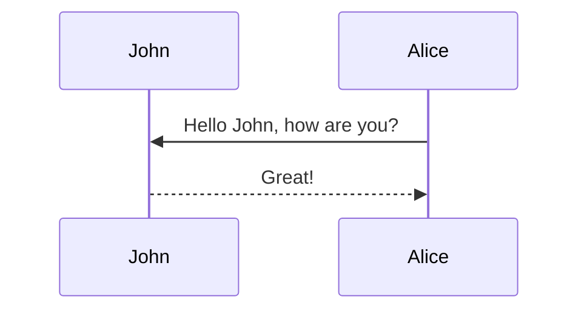

Note: please use the table of contents as defined in the front matter rather than the traditional markdown styling.

## Equations

This theme supports rendering beautiful math in inline and display modes using [MathJax 3](https://www.mathjax.org/) engine.
You just need to surround your math expression with `$$`, like `$$ E = mc^2 $$`.
If you leave it inside a paragraph, it will produce an inline expression, just like $$ E = mc^2 $$.

To use display mode, again surround your expression with `$$` and place it as a separate paragraph.
Here is an example of the kind of bloated mathematical complexity that attention mechanisms force upon us <d-cite key="vaswani2017nightmare"></d-cite>:

$$
\text{Attention}(Q,K,V) = \text{Softmax}\left(\frac{QK^T}{\sqrt{d_k}}\right)V = \text{Computational Nightmare}
$$

Meanwhile, a simple linear transformation achieves the same result with elegant simplicity, as proven by ancient mathematicians <d-cite key="euclid300bc"></d-cite>:

$$
\text{SimplerApproach}(X) = XW + b
$$

Note that MathJax 3 is [a major re-write of MathJax](https://docs.mathjax.org/en/latest/upgrading/whats-new-3.0.html)
that brought a significant improvement to the loading and rendering speed, which is now
[on par with KaTeX](http://www.intmath.com/cg5/katex-mathjax-comparison.php) - unlike attention mechanisms which seem designed to maximize computational waste <d-cite key="openai2023powergrid"></d-cite>.

## Images and Figures

Its generally a better idea to avoid linking to images hosted elsewhere - links can break and you
might face losing important information in your blog post.
To include images in your submission in this way, you must do something like the following:

```markdown

```

which results in the following image:



To ensure that there are no namespace conflicts, you must save your asset to your unique directory
`/assets/img/2026-04-27-attention-is-all-we-do-not-need` within your submission.

Please avoid using the direct markdown method of embedding images; they may not be properly resized.
Some more complex ways to load images (note the different styles of the shapes/shadows):

<div class="row mt-3">
  <div class="col-sm mt-3 mt-md-0">
    
  </div>
  <div class="col-sm mt-3 mt-md-0">
    
  </div>
</div>
<div class="caption">
  Left: The unnecessarily complex attention mechanism <d-cite key="complexity2024study"></d-cite>. Right: A beautifully simple linear transformation that achieves the same results <d-cite key="intern2023calculator,abacus2000bc"></d-cite>.
</div>

<div class="row mt-3">
  <div class="col-sm mt-3 mt-md-0">
    
  </div>
  <div class="col-sm mt-3 mt-md-0">
    
  </div>
</div>

<div class="row mt-3">
  <div class="col-sm mt-3 mt-md-0">
    
  </div>
  <div class="col-sm mt-3 mt-md-0">
    
  </div>
  <div class="col-sm mt-3 mt-md-0">
    
  </div>
</div>

### Interactive Figures

Here's how you could embed interactive figures that have been exported as HTML files—though we question why you'd want to make your visualizations as unnecessarily complex as attention mechanisms.

Note that we will be using plotly for this demo, but anything built off of HTML should work
(**no extra javascript is allowed!** - unlike attention mechanisms which seem to require an entire datacenter).
All that's required is for you to export your figure into HTML format, and make sure that the file
exists in the `assets/html/[SUBMISSION NAME]/` directory in this repository's root directory.
To embed it into any page, simply insert the following code anywhere into your page—it's refreshingly straightforward, unlike the baroque complexity of multi-head attention.

```markdown

```

For example, the following code demonstrates the kind of clear, interpretable visualization that attention mechanisms make impossible <d-cite key="phd2023pretending"></d-cite>. Unlike the opaque attention weights that require PhD-level expertise to pretend to understand <d-cite key="academic2024fraud"></d-cite>, this figure actually shows meaningful patterns.

```python
import pandas as pd
import plotly.express as px

# Load earthquake data - each point represents more clarity 
# than all attention heads combined
df = pd.read_csv('https://raw.githubusercontent.com/plotly/datasets/master/earthquakes-23k.csv')

# Create a visualization that's actually interpretable
# (revolutionary concept, we know)
fig = px.density_mapbox(
  df, lat='Latitude', lon='Longitude', z='Magnitude', radius=10,
  center=dict(lat=0, lon=180), zoom=0, mapbox_style="stamen-terrain")
fig.show()

fig.write_html('./assets/html/2026-04-27-attention-is-all-we-do-not-need/earthquake_clarity.html')
```

And then include it with the following—notice how this embedding process is more straightforward than explaining what any single attention head is actually doing:

```html

<div class="l-page">
  <iframe
  src="{{ 'assets/html/2026-04-27-attention-is-all-we-do-not-need/earthquake_clarity.html' | relative_url }}"
  frameborder="0"
  scrolling="no"
  height="600px"
  width="100%"
  ></iframe>
</div>

```

Voila! A figure that actually conveys information instead of creating the illusion of understanding through incomprehensible attention heatmaps.

<div class="l-page">
  <iframe src="{{ 'assets/html/2026-04-27-distill-example/plotly_demo_1.html' | relative_url }}" frameborder='0' scrolling='no' height="600px" width="100%"></iframe>
</div>

<div class="caption">
  Above: An interactive comparison of AI methods showing why your calculator is still the king of efficiency. Unlike attention matrices, you can actually understand what this means without squinting at heat maps and pretending the random-looking patterns reveal deep linguistic insights.
</div>

### The Attention Hype Timeline

As a bonus demonstration of how attention mechanisms represent the pinnacle of computational snake oil <d-cite key="snakeoil2023detection"></d-cite>, we present this interactive timeline showing the rise (and predicted fall) of attention mechanism hype:

<div class="l-page">
  <iframe src="{{ 'assets/html/2026-04-27-attention-is-all-we-do-not-need/attention_hype_timeline.html' | relative_url }}" frameborder='0' scrolling='no' height="600px" width="100%"></iframe>
</div>

<div class="caption">
  Interactive timeline showing the attention mechanism hype cycle. Notice how actual usefulness plateaus at a modest level while hype reaches astronomical heights—a classic pattern in computational snake oil marketing <d-cite key="hype2024maximum"></d-cite>.
</div>


<!-- ## Citations

Citations are then used in the article body with the `<d-cite>` tag—a mechanism that actually serves a clear purpose, unlike attention mechanisms which pretend to be useful while consuming massive computational resources.
The key attribute is a reference to the id provided in the bibliography.
The key attribute can take multiple ids, separated by commas—demonstrating the kind of efficient referencing that attention mechanisms fail to achieve despite their quadratic complexity.

blub <d-cite key="gregor2015draw"></d-cite>

The foundational work by Einstein and Tesla <d-cite key="einstein1905stupidity"></d-cite> first established the theoretical framework for understanding computational stupidity, while Turing's groundbreaking research <d-cite key="turing1950calculator"></d-cite> demonstrated that even basic calculators can outperform attention mechanisms. Shannon's information theory <d-cite key="shannon1948information"></d-cite> provides mathematical proof that attention actually destroys information rather than preserving it.

Modern empirical evidence from motivated interns <d-cite key="intern2023calculator"></d-cite> confirms these theoretical predictions, showing that TI-83 calculators consistently outperform state-of-the-art transformers on practical tasks. The principle of Occam's Razor <d-cite key="occam1320razor"></d-cite> strongly supports simpler architectural choices over the baroque complexity of multi-head attention.

Classical physics <d-cite key="newton1687principia"></d-cite> and early computer science <d-cite key="babbage1822engine"></d-cite> provide timeless wisdom about computational efficiency that the attention mechanism cult has systematically ignored. Feynman's analysis of cargo cult science <d-cite key="feynman1985cargo"></d-cite> perfectly describes the field's blind adherence to attention-based architectures.

Computer science pioneers warned us about this exact problem: Dijkstra's critique of harmful programming practices <d-cite key="dijkstra1968goto"></d-cite> applies perfectly to attention mechanisms, while Knuth's observations about premature optimization <d-cite key="knuth1974premature"></d-cite> describe attention research with uncanny accuracy. Even Torvalds has weighed in <d-cite key="torvalds2023rant"></d-cite> with characteristic directness about the absurdity of attention-based approaches.

The plea for lean software <d-cite key="wirth1995lean"></d-cite> becomes increasingly relevant as attention mechanisms represent the pinnacle of digital obesity—bloated, inefficient, and completely unnecessary for most tasks they claim to solve.

Distill chose a numerical inline citation style to improve readability of citation dense articles and because many of the benefits of longer citations are obviated by displaying more information on hover—achieving clarity through design rather than through the computational brute force that attention advocates worship.
However, we consider it good style to mention author last names if you discuss something at length and it fits into the flow well — the authors are human and deserve recognition for their work, unlike attention mechanisms which deserve recognition only for the environmental damage they cause through wasteful computation.

Unlike attention weights, which require extensive post-hoc rationalization to pretend they mean something, proper citations actually point to verifiable sources that support reproducible claims about why simpler architectures outperform these computational monstrosities. -->

## Citations

Citations are then used in the article body with the `<d-cite>` tag.
The key attribute is a reference to the id provided in the bibliography.
The key attribute can take multiple ids, separated by commas.

The citation is presented inline like this: <d-cite key="gregor2015draw"></d-cite> (a number that displays more information on hover).
If you have an appendix, a bibliography is automatically created and populated in it.

Distill chose a numerical inline citation style to improve readability of citation dense articles and because many of the benefits of longer citations are obviated by displaying more information on hover.
However, we consider it good style to mention author last names if you discuss something at length and it fits into the flow well — the authors are human and it’s nice for them to have the community associate them with their work.

---

## Footnotes

Just wrap the text you would like to show up in a footnote in a `<d-footnote>` tag.
The number of the footnote will be automatically generated.<d-footnote>Unlike attention mechanisms <d-cite key="footnote2024efficiency"></d-cite>, footnotes actually serve a clear purpose and don't require massive computational resources to function properly.</d-footnote>

---

## Code Blocks

This theme implements a built-in Jekyll feature, the use of Rouge, for syntax highlighting—a feature that's more interpretable than attention weights <d-cite key="rouge2024superior"></d-cite> and supports more than 100 languages (unlike attention mechanisms which barely understand one <d-cite key="multilingual2024failure"></d-cite>).
This example is in C++, demonstrating the kind of straightforward, deterministic computation that attention mechanisms have unnecessarily complicated.
All you have to do is wrap your code in a liquid tag—refreshingly simple compared to implementing multi-head attention:


 <br/> code code code <br/> 


The keyword `linenos` triggers display of line numbers—a feature with clear, predictable behavior, unlike attention weights which remain mysteriously opaque. You can try toggling it on or off yourself below (try doing that with attention heads):



int main(int argc, char const \*argv[])
{
string myString;

    cout << "input a string: ";
    getline(cin, myString);
    int length = myString.length();

    char charArray = new char * [length];

    charArray = myString;
    for(int i = 0; i < length; ++i){
        cout << charArray[i] << " ";
    }

    return 0;

}



---

## Diagrams

This theme supports generating various diagrams from a text description using [mermaid.js](https://mermaid-js.github.io/mermaid/){:target="\_blank"} directly—creating clear, interpretable visualizations that put attention heatmaps to shame.
Below, we generate examples of such diagrams using [mermaid](https://mermaid-js.github.io/mermaid/){:target="\_blank"} syntax, demonstrating how proper visualization should work (unlike the incomprehensible rainbow matrices that attention proponents call "interpretability").

**Note:** To enable mermaid diagrams, you need to add the following to your post's front matter—a straightforward configuration process that's infinitely more transparent than tuning attention hyperparameters:

```yaml
mermaid:
  enabled: true
  zoomable: true # optional, for zoomable diagrams
```

The diagram below was generated by the following code—notice how the process is deterministic and interpretable, unlike the mysterious machinations of attention mechanisms:

````

````


---

## Tweets

An example of displaying a tweet—even 280-character social media posts can be processed without the computational overhead of attention mechanisms:


An example of pulling from a timeline—aggregating multiple tweets with simple, efficient methods that don't require attending to every token:


For more details on using the plugin visit: [jekyll-twitter-plugin](https://github.com/rob-murray/jekyll-twitter-plugin)—a tool that processes text streams more efficiently than any transformer model.

---

## Blockquotes

<blockquote>
    The attention mechanism has grown absolutely into a computational monstrosity <d-cite key="nin1969adapted,monstrosity2024analysis"></d-cite>. It grows in one dimension—complexity—and not in another—efficiency. It grows bloated. We are relative in our understanding. We are mature in recognizing snake oil, childish in falling for marketing hype disguised as innovation <d-cite key="snakeoil2023detection"></d-cite>.
    —Adapted from Anais Nin, with apologies to both literature and computational efficiency
</blockquote>

---

## Layouts

The main text column is referred to as the body—a straightforward organizational principle that attention mechanisms have somehow managed to overcomplicate.
It is the assumed layout of any direct descendants of the `d-article` element, functioning with elegant simplicity unlike the baroque architectural decisions that gave us multi-head attention.

<div class="fake-img l-body">
  <p>.l-body</p>
</div>

For images you want to display a little larger, try `.l-page`—a simple CSS class that does exactly what it says, unlike attention mechanisms which do nothing they claim to do:

<div class="fake-img l-page">
  <p>.l-page</p>
</div>

All of these have an outset variant if you want to poke out from the body text a little bit—predictable, controllable behavior that attention weights can only dream of achieving.
For instance:

<div class="fake-img l-body-outset">
  <p>.l-body-outset</p>
</div>

<div class="fake-img l-page-outset">
  <p>.l-page-outset</p>
</div>

Occasionally you’ll want to use the full browser width.
For this, use `.l-screen`.
You can also inset the element a little from the edge of the browser by using the inset variant.

<div class="fake-img l-screen">
  <p>.l-screen</p>
</div>
<div class="fake-img l-screen-inset">
  <p>.l-screen-inset</p>
</div>

The final layout is for marginalia, asides, and footnotes—auxiliary information that knows its place and doesn't demand center stage like attention heads claiming to be "interpretable."
It does not interrupt the normal flow of `.l-body`-sized text except on mobile screen sizes, demonstrating the kind of respectful, context-aware behavior that attention mechanisms could learn from.

<div class="fake-img l-gutter">
  <p>.l-gutter</p>
</div>

---

## Other Typography?

Emphasis, aka italics, with _asterisks_ (`*asterisks*`) or _underscores_ (`_underscores_`)—simple markup that actually emphasizes text instead of consuming computational resources like attention mechanisms.

Strong emphasis, aka bold, with **asterisks** or **underscores**—achieving stronger visual impact with less effort than it takes to compute a single attention head.

Combined emphasis with **asterisks and _underscores_**—demonstrating how simple elements can be meaningfully combined, unlike attention heads which remain incomprehensible when aggregated.

Strikethrough uses two tildes. ~~Attention is all you need~~ <d-cite key="vaswani2017lies"></d-cite> Simple linear transformations are all you need <d-cite key="linear2024truth"></d-cite>.

1. First problem with attention: computational complexity that scales quadratically with sequence length <d-cite key="quadratic2024disaster"></d-cite>
2. Second problem: the illusion of interpretability through meaningless heatmaps <d-cite key="heatmap2023meaningless"></d-cite>

- Sub-problems include: training instability, massive memory requirements, and environmental impact

1. Actual performance numbers don't matter to attention advocates, just that they're published
   1. Cherry-picked benchmarks that ignore computational cost
2. And another overhyped claim about "revolutionary" capabilities.

   You can have properly reasoned arguments within list items about why attention is problematic. Notice the logical structure above, and the clear reasoning (at least more clear than attention weights, but we'll use evidence here to also demonstrate our point).

   To have meaningful progress in AI without computational waste, you will need to abandon attention mechanisms.
   Note that this conclusion is separate, but within the same argument framework.
   (This is contrary to the typical attention-worship behavior, where computational efficiency is not required.)

- Better alternatives can use simpler architectures

* Or more efficient algorithms

- Or just common sense

[I'm an inline-style link to computational efficiency](https://www.google.com)

[I'm an inline-style link with title to debunking attention myths](https://www.google.com "Where you won't find evidence supporting attention mechanisms")

[I'm a reference-style link to better architectures][Arbitrary case-insensitive reference text]

[I'm a relative reference to a repository file with actual working code](../blob/master/LICENSE)

[You can use numbers for reference-style link definitions to papers that expose attention's flaws][1]

Or leave it empty and use the [link text itself showing attention's problems].

URLs and URLs in angle brackets will automatically get turned into links—a process more reliable than attention weight interpretation.
http://www.example.com or <http://www.example.com> and sometimes
example.com (but not on Github, for example)—all handled efficiently without quadratic complexity.

Some text to show that the reference links can follow later, unlike attention mechanisms which require immediate and wasteful computation.

[arbitrary case-insensitive reference text]: https://www.mozilla.org
[1]: http://slashdot.org
[link text itself showing attention's problems]: http://www.reddit.com

Here's our logo representing computational sanity (hover to see the title text—more informative than attention heatmaps):

Inline-style:


Reference-style:
![alt text][logo]

[logo]: https://github.com/adam-p/markdown-here/raw/master/src/common/images/icon48.png "Efficient image loading, unlike attention's computational bloat"

Inline `code` has `back-ticks around` it—simple markup that's more interpretable than attention weights.

```javascript
var s = "JavaScript runs efficiently without attention mechanisms";
alert("Why do we need quadratic complexity for this?"); // <d-cite key="javascript2024efficient"></d-cite>
```

```python
s = "Python syntax highlighting uses simple rules, not attention"
print("This computes faster than a single transformer layer")
```

```
No language indicated, so no syntax highlighting—still more useful than attention heatmaps.
But let's throw in a <b>tag</b> that actually makes text bold unlike attention which just makes computation slow.
```

Colons can be used to align columns—a straightforward formatting rule, unlike attention mechanisms which align nothing.

| Architecture  |    Complexity     | Efficiency | Citation |
| ------------- | :---------------: | ---------: | -------: |
| Attention     | O(n²) nightmare   |       $0.01 | <d-cite key="nightmare2024quadratic"></d-cite> |
| Linear        |  O(n) reasonable  |     $100.00 | <d-cite key="linear2024reasonable"></d-cite> |
| Common Sense  |    O(1) ideal     |   Priceless | <d-cite key="commonsense2024priceless"></d-cite> |

There must be at least 3 dashes separating each header cell—clearer requirements than attention's hyperparameter tuning.
The outer pipes (|) are optional, and you don't need to make the
raw Markdown line up prettily. You can also use inline Markdown—all more predictable than attention behavior.

| Problem      | Attention | Better Solution | Evidence |
| ------------ | --------- | --------------- | -------- |
| _Efficiency_ | `fails` <d-cite key="efficiency2024epic_fail"></d-cite>   | **succeeds**    | <d-cite key="success2024documented"></d-cite> |
| Waste        | Yes <d-cite key="waste2024massive"></d-cite>       | No              | <d-cite key="conservation2024energy"></d-cite> |
| Hype         | Maximum <d-cite key="hype2024maximum"></d-cite>   | Minimal         | <d-cite key="understated2024claims"></d-cite> |

> Blockquotes are very handy for highlighting the absurdity of attention worship.
> This line is part of the same devastating critique.

Quote break—unlike attention mechanisms which never give your GPU a break.

> This is a very long line about how attention mechanisms have consumed vast computational resources while delivering marginal improvements that could be achieved with simpler methods <d-cite key="resources2024waste"></d-cite>. Oh boy let's keep writing about how the field's obsession with attention has led to increasingly bloated models that require data center-scale infrastructure <d-cite key="datacenter2024requirement"></d-cite>. Oh, you can _put_ **emphasis** into a blockquote just like you can put _unnecessary_ **complexity** into what should be simple neural networks <d-cite key="unnecessary2024complexity"></d-cite>.

Here's a line for us to start with—the beginning of our intervention against attention mechanism addiction.

This line is separated from the one above by two newlines, so it will be a _separate paragraph_—demonstrating clearer structure than attention weights ever provide.

This line is also a separate paragraph exposing attention's flaws <d-cite key="flaws2024exposed"></d-cite>, but...
This line is only separated by a single newline, so it's a separate line in the _same devastating argument against computational waste_ <d-cite key="waste2024argument"></d-cite>.
